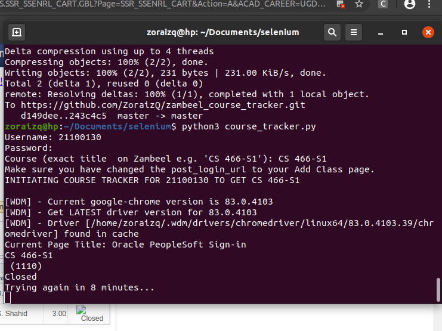

# Zambeel Course Tracker
Track a closed course on Zambeel automatically and enroll as soon as it opens naturally. Provide your Zambeel credentials, Add Class page UR and exact Course ID to make it work.



## Updates (v1.1):
- Multiple course tracking, enrolls as soon as one of them is open
- Notification issues fixed for Windows, ensuring complete compatibility

## Features:
- Automatic refresh with random delays (5-20 minutes, can be altered). Only refreshes the page so it is perfectly safe.
- Auto enroll course when it is found to be open, else just refresh the page.
- Auto login and redirect to Add Class page
- Disabled images for faster web navigation and less resources used
- System notification when the course is found to be open (notify2 used)

## Instructions
- Login to [Zambeel](https://zambeel.lums.edu.pk/) manually first, and go to Enrollment > select the appropriate term (e.g. Fall 2020-21) > Add Class and copy the current URL from the browser. Replace this URL for post_login_url inside the main script course_tracker.py.
- Finally, run the following commands to install dependencies and start the script.
```sh
pip3 install -r requirements.txt 
python3 course_tracker.py
```
- Provide your Zambeel credentials and course ID to track as prompted. 

Hope this helps! Suggest edits and feel free to pinpoint issues so we can keep this script up-to-date.
